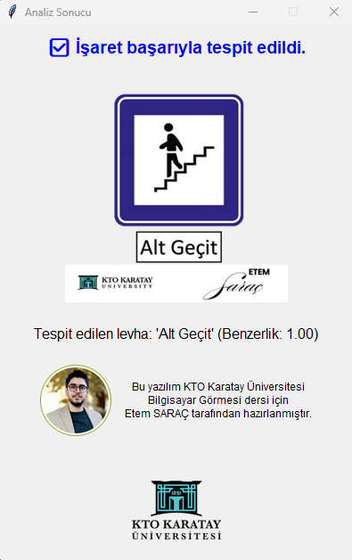

# 🚦 Traffic Sign Recognition with Image Processing & GUI

An interactive desktop application that identifies traffic signs from user-uploaded images using traditional image processing techniques. Developed in Python with OpenCV and Tkinter. This project was implemented as part of the **MSc Computer Vision course at KTO Karatay University.**.

---

## 🎯 Objective

This project aims to provide a practical solution for recognizing Turkish traffic signs using **template matching**. The system accepts a user image, compares it with a predefined sign dataset, and provides feedback via GUI and popup.

---

## 🧠 Technologies Used

| Component        | Tool              |
|------------------|-------------------|
| Language         | Python 3.12+       |
| GUI Framework    | Tkinter            |
| Image Processing | OpenCV             |
| Image Handling   | Pillow             |
| Packaging        | PyInstaller        |

---

## 🖥️ Application Features

- 🖼️ Upload and analyze traffic sign images
- 🔍 Match against 100+ templates using `cv2.matchTemplate()`
- 📊 Returns the most likely traffic sign name and confidence
- 🪟 Stylish popup displays image, result, and project credits
- 🇹🇷 Full Turkish character support for file names and labels
- 🏁 Packaged as standalone `.exe` using PyInstaller

---

## 🖼️ Screenshots

### ▶️ Main Interface


---

### 🪟 Popup Result Window



---

## 💾 Download Executable (.EXE)

👉 [Click here to download the latest version](https://github.com/etemesaysarac/Traffic-Sign-Recognition-Project-with-Image-Processing/releases)

> ⚠️ Windows only. No Python installation required.

---

## 🛠️ How to Run from Source

### 1. Clone Repository
```bash
git clone https://github.com/etemesaysarac/Traffic-Sign-Recognition-Project-with-Image-Processing.git
cd Traffic-Sign-Recognition-Project-with-Image-Processing


2. Install Dependencies
pip install opencv-python pillow

4. Run
python main.py

⚙️ How to Build Executable (.EXE)
Use PyInstaller:

pyinstaller --onefile --noconsole --icon=KTO_clean.ico ^
--add-data "Adsız tasarım.png;." ^
--add-data "KTO.png;." ^
--add-data "levhalar;levhalar" main.py
Make sure all resource files and main.py are in the same directory.

🔬 How It Works
User uploads a traffic sign image via the GUI.

The image is converted to grayscale.

Template matching is performed against all images in /levhalar.

The closest match above threshold (default: ≥ 0.8) is displayed.

Result shown in both the main panel and a popup window.

🧠 Potential Improvements
Replace matchTemplate() with a CNN classifier (e.g. using TensorFlow)

Add real-time webcam input

Expand traffic sign dataset

Translate interface dynamically (English ↔ Turkish)

👨‍💻 Project Owner
Etem SARAÇ
MSc Student – Computer Vision
KTO Karatay University, Turkey
GitHub: @etemesaysarac

🎓 Academic Info
This application was built as part of the graduate-level course Computer Vision. It demonstrates the application of classical image processing techniques to a real-world classification problem and was deployed as a fully-packaged GUI tool.

📜 License
This project is distributed for academic and educational use. For commercial use, please contact the author.
